# 🎫 SecuFusion — JWT Authentication Flow

## 1. Overview

SecuFusion operates on a highly decentralized, multi-tenant microservices architecture. To securely manage authentication and authorization across all services without introducing a single point of failure or performance bottlenecks, the platform uses **stateless JSON Web Tokens (JWTs)**. 

### Why JWT in SecuFusion?
* **Statelessness**: Microservices do not need to share a server-side session state.
* **Decentralization**: Each microservice can independently verify token validity without constantly polling the centralized identity provider (Keycloak).
* **Rich Context**: The JWT payload securely embeds user identity (`sub`), tenant boundaries (`iss`), and role-based access logic (`realm_access.roles`) making authorization immediate.

---

## 2. Login Flow

When a user attempts to log into the SecuFusion platform, the following sequential flow is executed:

1. **User Submits Credentials**: The frontend securely captures the username and password on the login screen.
2. **Gateway Routing**: The frontend sends a `POST /api/iam/auth/login` request. The API Gateway intercepts this and routes it via `lb://IAM-SERVICE` to the IAM service.
3. **Keycloak Delegation**: The IAM Service forwards the authentication request via an OIDC protocol call to Keycloak using the user's specific tenant realm endpoint.
4. **Validation & Issuance**: Keycloak validates the user credentials against its internal database.
5. **Token Generation**: Upon success, Keycloak issues an **Access Token** (typically valid for 5 minutes) and a **Refresh Token** (typically valid for 30 minutes).
6. **Return to Source**: The IAM service logs the telemetry of the login (publishing an asynchronous Kafka trace) and returns the token payload to the frontend.

---

## 3. JWT Structure

SecuFusion's JWTs are signed objects represented as: `Header.Payload.Signature`

### Header (JOSE)
Declares the signing algorithm and Key ID.
```json
{
  "alg": "RS256",
  "typ": "JWT",
  "kid": "unique-key-id-from-keycloak"
}
```

### Payload (Claims)
Contains the core identity and security context of the user.
```json
{
  "sub": "b2c3d4e5-f6a7...",          // Unique User UUID
  "iss": "https://auth-server/realms/tenantA", // Issuer identifies the Tenant Realm
  "exp": 1712345678,              // Expiry timestamp
  "iat": 1712345378,              // Issued At timestamp
  "azp": "secufusion-client",     // Authorized Party (Client ID)
  "realm_access": {
    "roles": ["ADMIN", "USER"]    // User Roles for RBAC
  }
}
```

### Signature
A cryptographic hash validating that the token was legitimately generated by Keycloak and has not been tampered with.
`RSASHA256(base64UrlEncode(header) + "." + base64UrlEncode(payload), RSA_PRIVATE_KEY)`

---

## 4. Backend JWT Validation

SecuFusion's microservices act as OAuth2 Resource Servers. Every incoming request must pass the Spring Security filter chain:

1. **Bearer Token Extraction**: The `BearerTokenAuthenticationFilter` extracts the JWT from the `Authorization: Bearer <token>` header.
2. **Signature Verification**: The JwtDecoder contacts Keycloak's public **JWK Set URI** (`/realms/{realm}/protocol/openid-connect/certs`) to retrieve the public key associated with the token's `kid`. It uses this to cryptographically verify the signature.
3. **Claims Validation**: The framework ensures the token has not expired (`exp` > current time), and verifies the issuer (`iss`) matches the expected tenant environment.
4. **Authentication Object Creation**: An `JwtAuthenticationToken` object is created and placed securely in the `SecurityContextHolder`.

---

## 5. Frontend Token Storage

For performance and security, the frontend handles tokens securely:
1. **Access Token**: Stored in fast access **In-Memory variables** (or robust state management like Redux/Zustand) to prevent XSS (Cross-Site Scripting) attacks from stealing the primary token.
2. **Refresh Token**: Stored securely as an `HttpOnly` cookie or in strictly managed `localStorage` depending on the environment architecture.
3. **Request Interceptors**: Axios/Fetch interceptor logic is configured to automatically append `Authorization: Bearer <access_token>` to every outbound HTTP request heading toward the API Gateway.

---

## 6. Token Refresh Flow

Access tokens are intentionally short-lived to minimize the risk of compromised sessions.

1. **Silent Expiry Catch**: When an API request fails with a `401 Unauthorized` response due to an expired Access token, the frontend interceptor halts the request flow.
2. **Refresh Call**: The frontend silently issues a `POST /api/iam/auth/refresh` including the valid Refresh Token.
3. **New Tokens Issued**: IAM consults Keycloak. If the refresh token is valid and the user hasn't been administratively revoked, new Access and Refresh tokens are returned.
4. **Request Replay**: The frontend updates its storage with the new Access token and seamlessly replays the original failed request.
5. **Force Logout Catch**: If the Refresh token itself is expired or revoked (Keycloak responds with `400/401`), the frontend automatically purges session data and forcefully redirects the user to the Login Page.

---

## 7. Service-Level Validation

SecuFusion achieves massive scale because individual microservices **do not** call Keycloak for every API request.

1. **Initial Caching**: When a microservice boots up, it pings Keycloak and caches the public JWK certificates.
2. **Independent Verification**: When the `sfn-events-api` or `sfn-tenants-api` receives a request, it uses its locally cached public keys to cryptographically prove the JWT's signature. 
3. **Trust Boundary**: Because only Keycloak holds the Private Key to sign tokens, the microservices intrinsically trust any token that passes math-based signature validation.

---

## 8. RBAC Check

Role-Based Access Control (RBAC) relies entirely on decoding the payload roles.

1. **Claim Extraction**: The backend's `JwtAuthenticationConverter` maps the Keycloak JSON structure `realm_access.roles` into standard Spring Security Granted Authorities (e.g., `ROLE_ADMIN`).
2. **Endpoint Enforcement**: Secure endpoints utilize Spring Security method annotations:
   ```java
   @PreAuthorize("hasAnyRole('ENTERPRISE_ADMIN', 'MSSP_ADMIN')")
   @PostMapping("/api/tenants/{id}/policies")
   public void createPolicy(...) { ... }
   ```
3. **Scope Matrix**: 
   * **MASTER MSSP / MSSP ADMIN**: Global tenant management control.
   * **ENT. ADMIN**: Read/Write for their own isolated Organization.
   * **USER**: Action-level access based solely on their specific department policies.
   * **VIEWER**: Strict read-only API access (`GET` requests only).

---

## 9. UI Rendering based on Roles

The frontend maintains UI security by pre-validating the user's role before querying the backend.

1. **Client-Side Decoding**: The frontend uses a library like `jwt-decode` to read the payload of the Access Token upon login without needing any cryptographic keys (since the payload is just Base64 encoded).
2. **Role Mapping**: The UI parses out the `realm_access.roles` array.
3. **Conditional Rendering**:
   * If the user is a `VIEWER`, the UI framework intentionally hides "Delete", "Edit", and "Create" buttons to present a clean Read-Only interface.
   * If the user is an `ENT. ADMIN`, the UI exposes Admin Configuration tabs and Policy Management panels.
   * This reduces unnecessary `403 Forbidden` network noise and vastly improves UX.

---

## 10. JWT Authentication Flow — Step by Step

```mermaid
flowchart TD
    classDef step fill:#ffffff,stroke:#e2e8f0,stroke-width:2px,color:#1e293b,text-align:left,padding:16px
    classDef blue stroke:#3b82f6
    classDef green stroke:#10b981
    classDef yellow stroke:#f59e0b

    1["<b>1. User Opens Portal</b><br/>User navigates to the web portal and enters<br/>login credentials (username + password)<br/><i>FRONTEND</i>"]:::step
    
    2["<b>2. Frontend → Backend</b><br/>Frontend sends POST /api/iam/auth/login<br/>with credentials to API Gateway<br/><i>FRONTEND → GATEWAY</i>"]:::step
    
    3["<b>3. Backend → Keycloak</b><br/>IAM service forwards auth request to<br/>Keycloak's OIDC endpoint for tenant realm<br/><i>BACKEND</i>"]:::step
    
    4["<b>4. Keycloak Validates</b><br/>Validates credentials against realm user store;<br/>Issues JWT access & refresh tokens<br/><i>KEYCLOAK</i>"]:::step
    
    5["<b>5. JWT Returned</b><br/>JWT flows back: Keycloak → IAM →<br/>Gateway → Frontend. Audit recorded.<br/><i>BACKEND → FRONTEND</i>"]:::step
    
    6["<b>6. JWT Stored</b><br/>Frontend stores tokens. Subsequent requests<br/>include Authorization: Bearer token<br/><i>FRONTEND</i>"]:::step
    
    7["<b>7. JWT Validated</b><br/>Each service validates JWT: verifies RS256<br/>signature via JWKS, checks expiry & issuer<br/><i>BACKEND (PER-SERVICE)</i>"]:::step
    
    8["<b>8. RBAC Check</b><br/>Backend extracts roles from realm_access.roles.<br/>Checks against defined scopes for endpoints.<br/><i>BACKEND</i>"]:::step
    
    9["<b>9. Access Decision</b><br/>Access granted (✓) or denied (✗ 403)<br/>based on roles (ADMIN, USER, VIEWER)<br/><i>BACKEND</i>"]:::step
    
    10["<b>10. UI Rendered</b><br/>Response to Frontend. UI conditionally renders<br/>based on role — admin vs read-only<br/><i>FRONTEND</i>"]:::step

    1:::blue --> 2:::blue --> 3:::green --> 4:::yellow 
    4 --> 5:::green --> 6:::blue --> 7:::green --> 8:::green 
    8 --> 9:::green --> 10:::blue
```


