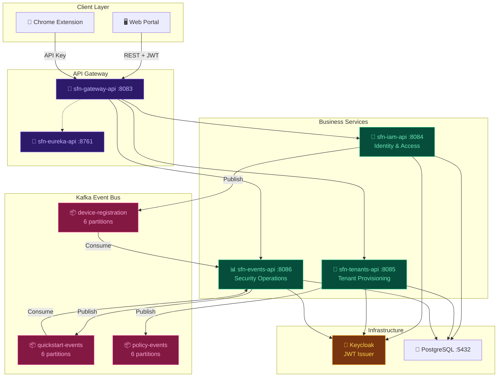
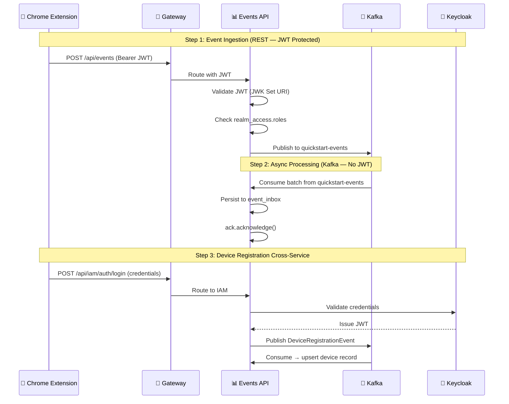
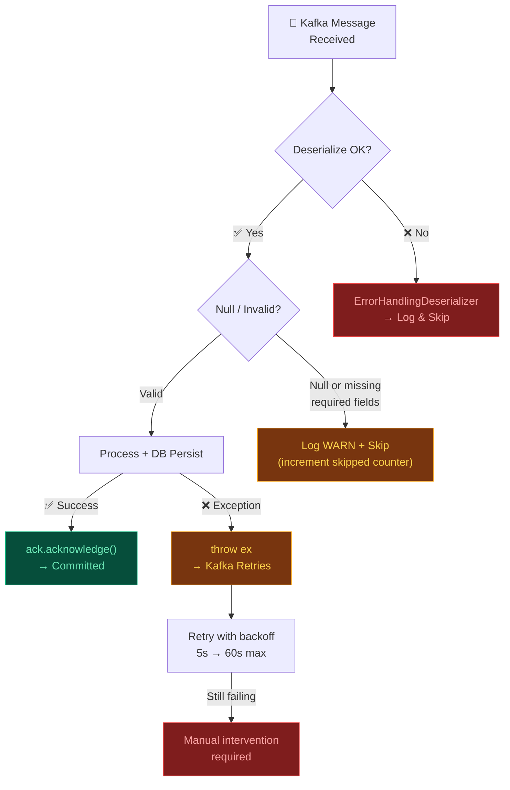

# 📨 SecuFusion — Kafka Event-Driven Architecture

> **Everything is an event.** This document covers SecuFusion's Kafka-based messaging layer — topic design, event catalog, producer/consumer configurations, security integration, and error handling.

---

## Table of Contents

- [Overview](#-overview)
- [System Architecture](#-system-architecture)
- [Kafka Topic Design](#-kafka-topic-design)
- [Event Catalog](#-event-catalog)
- [Service Breakdown](#-service-breakdown)
- [Security Flow — Keycloak JWT + Kafka](#-security-flow--keycloak-jwt--kafka)
- [Kafka Configuration](#-kafka-configuration)
- [How to Run](#-how-to-run)
- [Error Handling](#-error-handling)
- [Tech Stack](#-tech-stack)

---

## 🎯 Overview

### Why Event-Driven?

SecuFusion is a browser security platform where **everything that happens is an event** — a user login, a device connecting, a policy update, a phishing attempt blocked, a file upload intercepted. These events must flow between loosely-coupled microservices without creating a tightly-coupled REST mesh.

### Why Kafka?

| Concern | How Kafka Solves It |
|---------|-------------------|
| **Decoupling** | IAM doesn't know Events service exists — it publishes to a topic, done |
| **Reliability** | Manual `ack` mode ensures events commit only after DB persistence succeeds |
| **Ordering** | `tenantId` as partition key guarantees per-tenant event ordering |
| **Scale** | 6 partitions per topic → up to 6 parallel consumers per group |
| **Replay** | Kafka retention enables event replay for debugging and reprocessing |
| **Multi-tenant isolation** | Partition key = `tenantId` ensures tenant data locality |
| **Backpressure** | Batch consumption (`spring.kafka.listener.type=batch`) handles event bursts gracefully |

### Communication Patterns

SecuFusion uses **two** communication styles — Kafka is never the only path:

```
Synchronous:   Client → Gateway → Service → PostgreSQL → Response
Asynchronous:  Service → Kafka Topic → Consumer Service → DB Persist
```

Key principle: **No direct REST calls between business services.** Services expose their own APIs, use their own persistence, and integrate through Kafka + shared infrastructure (Keycloak).

---

## 🏗 System Architecture



### Kafka-Specific Data Flows

```
Flow 1: Device Registration
  User Login → IAM API → Kafka[device-registration] → Events API → devices table

Flow 2: Security Event Ingestion
  Extension/Client → Events API → Kafka[quickstart-events] → Events Consumer → event_inbox table

Flow 3: Policy Change Broadcast
  Admin updates policy → Tenants API → Kafka[policy-events] → WebSocket → Extension
```

---

## 📨 Kafka Topic Design

### Topics

| Topic | Partitions | Replicas | Key | Source |
|-------|-----------|----------|-----|--------|
| `device-registration` | 6 | 1 | `tenantId` | [KafkaTopicConfig.java (IAM)](sfn-iam-api%204/sfn-iam-api/src/main/java/com/secufusion/iam/config/KafkaTopicConfig.java) |
| `quickstart-events` | 6 | 1 | `tenantId` | [KafkaTopicConfig.java (Events)](sfn-events-api%202/sfn-events-api/src/main/java/com/secufusion/events/config/KafkaTopicConfig.java) |
| `policy-events` | 6 | 1 | `tenantId` | [KafkaTopicConfig.java (Tenants)](sfn-tenants-api%203/sfn-tenants-api/src/main/java/com/secufusion/tenant/config/KafkaTopicConfig.java) |

### Naming Convention

```
{domain}-{entity/action}

Examples:
  device-registration    → domain=device, action=registration
  quickstart-events      → domain=quickstart, aggregate=events
  policy-events          → domain=policy, aggregate=events
```

### Partition Strategy

All 3 topics use **`tenantId`** as the Kafka message key:

```java
kafkaTemplate.send(
    KafkaTopicConfig.DEVICE_REGISTRATION_TOPIC,
    event.getTenantId(),   // KEY = tenant for partition routing
    event
);
```

This guarantees:
- ✅ All events for a single tenant go to the **same partition**
- ✅ **Ordering** is maintained per tenant (not globally)
- ✅ 6 partitions allow **up to 6 consumer instances** per group
- ✅ Tenant data **locality** enables efficient batch processing

### Consumer Groups

| Group ID | Service | Topic | Mode |
|----------|---------|-------|------|
| `device-registration-consumer-group` | Events API | `device-registration` | Batch, Manual Ack |
| `event-consumer-group-v2` | Events API | `quickstart-events` | Batch, Manual Ack |
| `policy-ws-group` | Tenants API | `policy-events` | Batch, Manual Ack *(currently disabled in code)* |

---

## 📖 Event Catalog

### 1. Kafka Inter-Service Events

#### `DeviceRegistrationEvent` — IAM → Events

> Published when a user logs in with device information. Consumed by Events API to create/update device records.

```java
public class DeviceRegistrationEvent {
    String eventId;           // UUID
    String tenantId;          // Partition key
    String userId;            // Keycloak user ID
    String userName;          // Display name
    String deviceFingerprint; // Unique device identifier (MANDATORY)
    String deviceId;          // Device UUID
    String deviceName;        // e.g. "John's Laptop"
    String browserType;       // e.g. "Chrome"
    String osInfo;            // e.g. "Windows 11"
    String userAgent;         // Full UA string
    String ipAddress;         // e.g. "192.168.1.1"
    String location;          // Geo location
    String extensionVersion;  // e.g. "1.2.3"
    long   loginTimestamp;    // Epoch millis
    String loginType;         // WEBSITE | EXTENSION
}
```

**Producer:** [`DeviceRegistrationProducer.java`](sfn-iam-api%204/sfn-iam-api/src/main/java/com/secufusion/iam/kafka/DeviceRegistrationProducer.java)
**Consumer:** [`DeviceRegistrationConsumer.java`](sfn-events-api%202/sfn-events-api/src/main/java/com/secufusion/events/kafka/DeviceRegistrationConsumer.java)

---

#### `EventKafkaMessage` — Events → Events (Self-Managed Pipeline)

> Published when security events are ingested via API. Consumed by the same service to persist into the event inbox for async processing.

```java
public class EventKafkaMessage {
    String   eventId;     // UUID (MANDATORY)
    String   tenantId;    // Partition key
    String   userName;    // User who triggered the event
    EventDto event;       // Full event payload (nested — see below)
    long     occurredAt;  // Epoch millis
}
```

**`EventDto` payload fields:**

| Category | Fields |
|----------|--------|
| **Core** | `url`, `domain`, `timeStamp`, `browserType`, `deviceType`, `ipAddress`, `location`, `eventType`, `title`, `durationSeconds`, `category` |
| **DLP / File** | `fileOperationType`, `fileName`, `fileSize`, `fileType`, `isBlocked` |
| **Security** | `isSecurityEvent`, `severity`, `threatType`, `threatLevel`, `actionTaken`, `riskLevel` |
| **Policy** | `isPolicyViolation`, `policyRuleId`, `policyName`, `policyType`, `filterType`, `patternType`, `matchedPattern` |
| **Compliance** | `complianceImpact`, `processingStatus`, `mitreMapping` (MITRE ATT&CK technique IDs) |
| **Device** | `deviceId`, `deviceName`, `osInfo`, `deviceStatus`, `deviceUserId`, `deviceUserEmail` |

**Producer:** [`EventKafkaProducer.java`](sfn-events-api%202/sfn-events-api/src/main/java/com/secufusion/events/kafka/EventKafkaProducer.java)
**Consumer:** [`EventKafkaConsumer.java`](sfn-events-api%202/sfn-events-api/src/main/java/com/secufusion/events/kafka/EventKafkaConsumer.java)

---

#### `PolicyChangeEvent<T>` — Tenants → Broadcast

> Published when a browser, network, or extension policy is created, updated, or deleted. Generic type `T` carries the full policy entity.

```java
public class PolicyChangeEvent<T> {
    String  tenantId;     // Partition key
    String  policyId;     // Policy UUID
    String  eventType;    // CREATED | UPDATED | DELETED
    T       policy;       // Full policy entity (BrowserPolicy, NetworkPolicy, etc.)
    Instant timestamp;    // When the change occurred
}
```

**Producer:** [`PolicyKafkaProducer.java`](sfn-tenants-api%203/sfn-tenants-api/src/main/java/com/secufusion/tenant/util/PolicyKafkaProducer.java)
**Consumer:** [`PolicyKafkaConsumer.java`](sfn-tenants-api%203/sfn-tenants-api/src/main/java/com/secufusion/tenant/util/PolicyKafkaConsumer.java) *(currently disabled — was forwarding to WebSocket)*

---

### 2. Browser Security Events (EventType Enum)

Events stored in the `events` table via the Kafka ingestion pipeline.

| EventType | Category | Description | Typical Severity |
|-----------|----------|-------------|-----------------|
| `WEBSITE_VISIT` | Browsing | URL navigation / page load | Info |
| `TRACKING_ACTIVITY` | Browsing | Analytics/tracking script detection | Low |
| `FILE_OPERATION` | DLP | Generic file operation (legacy) | Medium |
| `FILE_DOWNLOAD` | DLP | File download detected | Medium |
| `FILE_UPLOAD` | DLP | File upload detected | Medium |
| `FILE_PRINT` | DLP | Document print operation | Medium |
| `FILE_CLIPBOARD_COPY` | DLP | Copy to clipboard | Medium |
| `FILE_CLIPBOARD_PASTE` | DLP | Paste from clipboard | Medium |
| `USER_BEHAVIOR` | Monitoring | Copy/paste, screenshot, idle detection | Info |
| `SYSTEM_CONFIGURATION` | System | Extension settings changes, policy sync | Info |
| `POLICY_VIOLATION` | Security | Blocked actions, DLP triggers | High |
| `SECURITY_THREAT` | Security | CSP violations, malware, phishing, XSS | Critical |
| `EXTENSION_VIOLATION` | Security | Blocked extensions, compliance blocks | High |
| `DLP_EVENT` | DLP | File monitoring, PII detection | High |
| `NETWORK_VIOLATION` | Network | Blocked URLs, blacklist enforcement | High |

### 3. File / Threat Operation Types (FileOperationType Enum)

Sub-classification for file and threat events:

| Operation | Description | Severity |
|-----------|-------------|----------|
| `DOWNLOAD` / `FILE_DOWNLOAD` | File download detected | Medium |
| `UPLOAD` / `FILE_UPLOAD` | File upload detected | Medium |
| `PRINT` | Document print operation | Medium |
| `CLIPBOARD_COPY` | Copy to clipboard | Medium |
| `CLIPBOARD_PASTE` | Paste from clipboard | Medium |
| `BLOCKED_EXTENSION_INSTALLED` | Prohibited extension blocked | High |
| `PII_IN_FILE` | PII detected in file upload/download | Critical |
| `URL_BLOCKED` | URL blocked by blacklist/whitelist policy | High |
| `EXTENSION_COMPLIANCE_BLOCK` | Extension compliance violation | High |
| `PHISHING_DETECTION` | Phishing site detected (warned/blocked) | Critical |
| `CREDENTIAL_THEFT_BLOCKED` | Credential submission to untrusted domain | Critical |
| `PHISHING_FALSE_POSITIVE` | User reported false positive | Info |
| `SCRIPT_INJECTION` | Suspicious script injection detected | Critical |
| `FORM_HIJACKING` | Form action hijacked to cross-origin domain | Critical |

### 4. Extension Events (ExtensionEventType Enum)

Stored in the `extension_events` table:

| Event | Description |
|-------|-------------|
| `EXTENSION_INSTALLED` | Extension installed on a device |
| `EXTENSION_UNINSTALLED` | Extension removed from a device |
| `EXTENSION_UPDATED` | Extension updated to new version |
| `EXTENSION_ENABLED` | Extension re-enabled |
| `EXTENSION_DISABLED` | Extension disabled |
| `EXTENSION_PERMISSIONS_CHANGED` | Extension permissions modified |
| `EXTENSION_BLOCKED` | Extension blocked by policy |
| `EXTENSION_WARNING_SHOWN` | Warning displayed about extension |
| `EXTENSION_WARNING_ACKNOWLEDGED` | User dismissed extension warning |
| `EXTENSION_SYNC` | Policy sync from server completed |

### 5. Login Audit Events (LoginEventType Enum)

Stored in the `login_audit_event` table across IAM and Tenants services:

| Category | Events |
|----------|--------|
| **Authentication** | `LOGIN_SUCCESS`, `LOGIN_FAILURE`, `LOGOUT`, `LOGOUT_ALL`, `SESSION_REVOKED`, `TOKEN_REFRESH`, `TOKEN_REFRESH_FAILURE` |
| **Password** | `PASSWORD_RESET_REQUEST`, `PASSWORD_RESET_SUCCESS`, `PASSWORD_CHANGE` |
| **MFA** | `MFA_CHALLENGE`, `MFA_SUCCESS`, `MFA_FAILURE` |
| **Account** | `ACCOUNT_LOCKED`, `ACCOUNT_UNLOCKED`, `ACCOUNT_DISABLED`, `ACCOUNT_ENABLED` |
| **Identity Provider** | `IDENTITY_PROVIDER_LOGIN`, `IDENTITY_PROVIDER_LINK`, `IDENTITY_PROVIDER_UNLINK` |
| **User Management** | `USER_CREATED`, `USER_UPDATED`, `USER_DELETED`, `USER_ENABLED`, `USER_DISABLED`, `USER_EMAIL_VERIFIED`, `USER_PASSWORD_SET`, `USER_ATTRIBUTES_UPDATED` |
| **Role Management** | `ROLE_CREATED`, `ROLE_UPDATED`, `ROLE_DELETED`, `ROLE_ASSIGNED_TO_USER`, `ROLE_REMOVED_FROM_USER`, `ROLE_PERMISSIONS_UPDATED` |
| **Group Management** | `GROUP_CREATED`, `GROUP_UPDATED`, `GROUP_DELETED`, `USER_ADDED_TO_GROUP`, `USER_REMOVED_FROM_GROUP`, `ROLE_ASSIGNED_TO_GROUP`, `ROLE_REMOVED_FROM_GROUP` |
| **Scope Management** | `SCOPE_CREATED`, `SCOPE_UPDATED`, `SCOPE_DELETED` |
| **Client/App** | `CLIENT_CREATED`, `CLIENT_UPDATED`, `CLIENT_DELETED`, `CLIENT_SECRET_ROTATED`, `CLIENT_SCOPE_ASSIGNED`, `CLIENT_SCOPE_REMOVED` |
| **Permissions** | `PERMISSION_CREATED`, `PERMISSION_UPDATED`, `PERMISSION_DELETED`, `PERMISSION_ASSIGNED`, `PERMISSION_REVOKED` |
| **Policy** | `POLICY_CREATED`, `POLICY_UPDATED`, `POLICY_DELETED` |
| **Tenant** | `TENANT_CREATED`, `TENANT_UPDATED`, `TENANT_DELETED`, `TENANT_SUSPENDED`, `TENANT_ACTIVATED`, `TENANT_SETTINGS_UPDATED` |
| **OAuth2** | `IMPERSONATION_START`, `IMPERSONATION_END`, `CONSENT_GRANTED`, `CONSENT_REVOKED`, `REGISTER`, `REGISTER_ERROR`, `VERIFY_EMAIL`, `UPDATE_EMAIL`, `UPDATE_PROFILE`, `CLIENT_LOGIN`, `CODE_TO_TOKEN`, `CODE_TO_TOKEN_ERROR` |

### 6. Incident Lifecycle

```
OPEN → INVESTIGATING → RESOLVED → CLOSED
                   ↘ FALSE_POSITIVE
                   ↘ MERGED
```

**Priority:** P1 (Critical) → P2 (High) → P3 (Medium) → P4 (Low)
**Source:** `MANUAL` (user-created) or `AUTO` (escalation rule triggered, `autoRuleName` populated)

---

## ⚙️ Service Breakdown

### sfn-iam-api (:8084) — Producer

| Aspect | Details |
|--------|---------|
| **Publishes to** | `device-registration` |
| **Event DTO** | `DeviceRegistrationEvent` |
| **Trigger** | User login with device fingerprint/info |
| **Key** | `tenantId` |
| **Null Guard** | Skips if `event == null` or `deviceFingerprint == null` |
| **Async?** | No (fire-and-forget with `whenComplete` logging) |

```java
// DeviceRegistrationProducer.java
kafkaTemplate.send(
    KafkaTopicConfig.DEVICE_REGISTRATION_TOPIC,
    event.getTenantId(),  // KEY = tenant for partition routing
    event
).whenComplete((result, ex) -> {
    if (ex != null) log.error("Failed: {}", event.getEventId(), ex);
    else log.info("Published: partition={} offset={}", ...);
});
```

### sfn-tenants-api (:8085) — Producer

| Aspect | Details |
|--------|---------|
| **Publishes to** | `policy-events` |
| **Event DTO** | `PolicyChangeEvent<T>` (generic — carries full policy entity) |
| **Trigger** | Browser/Network/Extension policy CREATED, UPDATED, or DELETED |
| **Key** | `tenantId` |
| **Async?** | Yes (`@Async` annotation) |

```java
// PolicyKafkaProducer.java
@Async
public void send(PolicyChangeEvent event) {
    kafkaTemplate.send(
        KafkaTopicConfig.POLICY_EVENTS_TOPIC,
        event.getTenantId(),   // key = tenant
        event
    );
    log.info("Policy event sent: {}", event.getEventType());
}
```

### sfn-events-api (:8086) — Producer + Consumer

| Aspect | Details |
|--------|---------|
| **Publishes to** | `quickstart-events` |
| **Consumes from** | `device-registration`, `quickstart-events` |
| **Consumer Groups** | `device-registration-consumer-group`, `event-consumer-group-v2` |

**Consumer: Device Registration**
```java
@KafkaListener(
    topics = "device-registration",
    groupId = "device-registration-consumer-group",
    containerFactory = "deviceRegistrationKafkaListenerContainerFactory"
)
@Transactional
public void consume(List<DeviceRegistrationEvent> events, Acknowledgment ack) {
    for (DeviceRegistrationEvent event : events) {
        // Upsert device by (fingerprint + tenantId)
        // Update: lastSeenAt, userName, userAgent, browserType, ipAddress, etc.
        // Create: new Device with ACTIVE status
    }
    ack.acknowledge();  // Commit ONLY after DB success
}
```

**Consumer: Security Events**
```java
@KafkaListener(
    topics = "quickstart-events",
    groupId = "event-consumer-group-v2",
    containerFactory = "kafkaListenerContainerFactory"
)
public void consume(List<EventKafkaMessage> messages, Acknowledgment ack) {
    List<EventInboxEntity> inbox = messages.stream()
        .filter(Objects::nonNull)
        .map(msg -> new EventInboxEntity(msg.getEventId(), msg.getTenantId(), ...))
        .toList();

    inboxRepository.saveAll(inbox);  // Batch persist
    ack.acknowledge();               // Commit ONLY after DB success
}
```

---

## 🔒 Security Flow — Keycloak JWT + Kafka

### How JWT Integrates with Event-Consuming Services



### Key Security Points

| Point | Detail |
|-------|--------|
| **REST APIs** | All protected by JWT — validated via Keycloak JWK Set URI |
| **Kafka messages** | Do NOT carry JWT — they carry `tenantId` and `userName` from the already-validated request |
| **Trust boundary** | JWT validation happens at the **REST ingestion point** (API controller). Once validated, the event is trusted within the Kafka pipeline |
| **Tenant isolation** | `tenantId` in every Kafka message ensures events are scoped to the correct tenant |
| **RBAC** | 38 scopes enforced at API level before any event is published to Kafka |

### JWT Validation (per service)

```
Endpoint: /realms/{realm}/protocol/openid-connect/certs

Steps:
  1. Verify RS256 signature using JWK public key
  2. Check token expiry (exp claim)
  3. Validate issuer (iss = Keycloak realm URL)
  4. Validate client (azp = "secufusion")
  5. Extract realm_access.roles → match against required scopes
```

---

## 🔧 Kafka Configuration

### Producer — `application.properties`

```properties
spring.kafka.bootstrap-servers=${KAFKA_SERVER}

# Serialization
spring.kafka.producer.key-serializer=org.apache.kafka.common.serialization.StringSerializer
spring.kafka.producer.value-serializer=org.springframework.kafka.support.serializer.JsonSerializer
spring.kafka.producer.properties.spring.json.add.type.headers=false
```

### Consumer — Events API `application.properties`

```properties
spring.kafka.bootstrap-servers=${KAFKA_SERVER}

# Manual batch acknowledgment
spring.kafka.consumer.enable-auto-commit=false
spring.kafka.listener.ack-mode=manual
spring.kafka.listener.type=batch

# Deserialization with error handling wrapper
spring.kafka.consumer.key-deserializer=org.apache.kafka.common.serialization.StringDeserializer
spring.kafka.consumer.value-deserializer=org.springframework.kafka.support.serializer.ErrorHandlingDeserializer
spring.kafka.consumer.properties.spring.deserializer.value.delegate.class=org.springframework.kafka.support.serializer.JsonDeserializer

# Trusted default type
spring.kafka.consumer.properties.spring.json.value.default.type=com.secufusion.events.dto.EventKafkaMessage
spring.kafka.consumer.properties.spring.json.trusted.packages=*

# Producer (for quickstart-events self-pipeline)
spring.kafka.producer.key-serializer=org.apache.kafka.common.serialization.StringSerializer
spring.kafka.producer.value-serializer=org.springframework.kafka.support.serializer.JsonSerializer
```

### Consumer — Tenants API `application.properties`

```properties
spring.kafka.bootstrap-servers=${KAFKA_SERVER}
spring.kafka.consumer.bootstrap-servers=${KAFKA_SERVER}

# Reconnection backoff
spring.kafka.consumer.properties.reconnect.backoff.ms=5000
spring.kafka.consumer.properties.reconnect.backoff.max.ms=60000

# Consumer group
spring.kafka.consumer.group-id=policy-ws-group
spring.kafka.consumer.auto-offset-reset=latest
spring.kafka.consumer.enable-auto-commit=false

# Batch + Manual Ack
spring.kafka.listener.type=batch
spring.kafka.listener.ack-mode=manual

# Deserialization
spring.kafka.consumer.key-deserializer=org.apache.kafka.common.serialization.StringDeserializer
spring.kafka.consumer.value-deserializer=org.springframework.kafka.support.serializer.ErrorHandlingDeserializer
spring.kafka.consumer.properties.spring.deserializer.value.delegate.class=org.springframework.kafka.support.serializer.JsonDeserializer
spring.kafka.consumer.properties.spring.json.value.default.type=com.secufusion.tenant.dto.PolicyChangeEvent
spring.kafka.consumer.properties.spring.json.trusted.packages=com.secufusion.tenant.dto
spring.kafka.consumer.properties.spring.json.use.type.headers=false

# Producer
spring.kafka.producer.key-serializer=org.apache.kafka.common.serialization.StringSerializer
spring.kafka.producer.value-serializer=org.springframework.kafka.support.serializer.JsonSerializer
spring.kafka.producer.properties.spring.json.add.type.headers=false
```

### Topic Creation — Java Config

```java
@Configuration
public class KafkaTopicConfig {

    // Events API defines both topics it interacts with
    public static final String EVENTS_TOPIC = "quickstart-events";
    public static final String DEVICE_REGISTRATION_TOPIC = "device-registration";

    @Bean
    public NewTopic eventsTopic() {
        return TopicBuilder.name(EVENTS_TOPIC)
                .partitions(6)
                .replicas(1)
                .build();
    }

    @Bean
    public NewTopic deviceRegistrationTopic() {
        return TopicBuilder.name(DEVICE_REGISTRATION_TOPIC)
                .partitions(6)
                .replicas(1)
                .build();
    }
}
```

---

## 🚀 How to Run

### Prerequisites

| Dependency | Required | Notes |
|-----------|----------|-------|
| Apache Kafka | 3.x | With Zookeeper or KRaft mode |
| Zookeeper | 3.8+ | Required if Kafka runs in Zookeeper mode |
| PostgreSQL | 14+ | Shared database for all services |
| Keycloak | 22+ | OIDC provider for JWT issuance |
| Java | 17+ | Spring Boot 3.x requirement |

### Startup Order

```
Phase 1: Infrastructure (run BEFORE any Spring Boot service)
  ┌──────────────┐    ┌──────────────┐    ┌──────────────┐
  │  Zookeeper   │ →  │    Kafka     │    │  PostgreSQL  │
  │   :2181      │    │   :9092      │    │   :5432      │
  └──────────────┘    └──────────────┘    └──────────────┘
                                           ┌──────────────┐
                                           │  Keycloak    │
                                           │   :443       │
                                           └──────────────┘

Phase 2: Service Discovery
  ┌──────────────────────────┐
  │  sfn-eureka-api   :8761  │  ← Wait for "Started SfnEurekaApiApplication"
  └──────────────────────────┘

Phase 3: Gateway + Business Services
  ┌──────────────────────────┐
  │  sfn-gateway-api  :8083  │
  └──────────────────────────┘
  ┌──────────────────────────┐
  │  sfn-iam-api      :8084  │  ← Producer: device-registration
  └──────────────────────────┘
  ┌──────────────────────────┐
  │  sfn-tenants-api  :8085  │  ← Producer: policy-events
  └──────────────────────────┘
  ┌──────────────────────────┐
  │  sfn-events-api   :8086  │  ← Consumer: device-registration, quickstart-events
  └──────────────────────────┘
```

### Start Kafka (Local)

```bash
# Terminal 1 — Zookeeper
bin/zookeeper-server-start.sh config/zookeeper.properties

# Terminal 2 — Kafka Broker
bin/kafka-server-start.sh config/server.properties
```

### Verify Topics

```bash
# List topics
bin/kafka-topics.sh --list --bootstrap-server localhost:9092

# Expected:
#   device-registration
#   quickstart-events
#   policy-events

# Describe a topic
bin/kafka-topics.sh --describe --topic device-registration --bootstrap-server localhost:9092
# → Partitions: 6, Replicas: 1
```

### Monitor Consumer Lag

```bash
bin/kafka-consumer-groups.sh --bootstrap-server localhost:9092 \
  --describe --group device-registration-consumer-group

bin/kafka-consumer-groups.sh --bootstrap-server localhost:9092 \
  --describe --group event-consumer-group-v2
```

---

## ❌ Error Handling

### Error Strategy Overview



### Error Handling Mechanisms

| Layer | Strategy | Code Reference |
|-------|----------|----------------|
| **Deserialization** | `ErrorHandlingDeserializer` wraps `JsonDeserializer` — logs and skips corrupt/unreadable messages | `application.properties` |
| **Null Safety** | Null check on message + required fields before processing | `DeviceRegistrationConsumer.consume()` |
| **Atomic Commit** | `ack.acknowledge()` called **only** after successful `saveAll()` / DB persist | All consumers |
| **Retry** | On exception → `throw ex` → Kafka redelivers with configurable backoff | `reconnect.backoff.ms=5000` |
| **Idempotency** | Device upsert by `(fingerprint, tenantId)` — duplicate events safely update existing records | `DeviceRegistrationConsumer.processDeviceRegistration()` |
| **Batch Atomicity** | Entire batch committed or retried atomically | Batch `@KafkaListener` |
| **Async Fire-and-Forget** | Producers use `whenComplete` for non-blocking error logging | `DeviceRegistrationProducer`, `EventKafkaProducer` |

### Dead Letter Topics (DLT)

> ⚠️ **Not yet implemented.** Currently, failed messages retry until manual intervention.
>
> Recommended DLT pattern for future:
> ```
> device-registration.DLT
> quickstart-events.DLT
> ```
> Use Spring Kafka's `DefaultErrorHandler` with `DeadLetterPublishingRecoverer` for automatic DLT routing after N retries.

### Key Log Patterns to Monitor

```
✅ Normal:
  [KAFKA] Received device registration batch size=N
  [KAFKA] Device registration batch completed: processed=N skipped=N
  ✅ Kafka sent eventId=... partition=N offset=N

⚠️ Warning:
  Skipping invalid device registration event: ...
  Skipping device registration event: missing fingerprint

❌ Error (ALERT):
  [KAFKA] Failed to process device registration batch
  [KAFKA] Failed to persist inbox batch
  ❌ Kafka send failed eventId=... tenant=...
  Failed to send policy event to Kafka: ...
```

---

## 🔩 Tech Stack

| Component | Technology |
|-----------|-----------|
| **Messaging** | Apache Kafka 3.x |
| **Serialization** | Spring Kafka `JsonSerializer` / `JsonDeserializer` |
| **Error Handling** | `ErrorHandlingDeserializer` wrapper |
| **Ack Mode** | Manual batch acknowledgment |
| **Consumer Mode** | Batch (`spring.kafka.listener.type=batch`) |
| **Framework** | Spring Boot 3.x, Spring Kafka |
| **Database** | PostgreSQL 14+ (event persistence target) |
| **Auth** | Keycloak (JWT validation at REST layer, not in Kafka) |
| **Async** | `@Async` for fire-and-forget producers (Tenants) |
| **Transactions** | `@Transactional` on device registration consumer |

---

*SecuFusion Kafka Architecture — April 2026*
