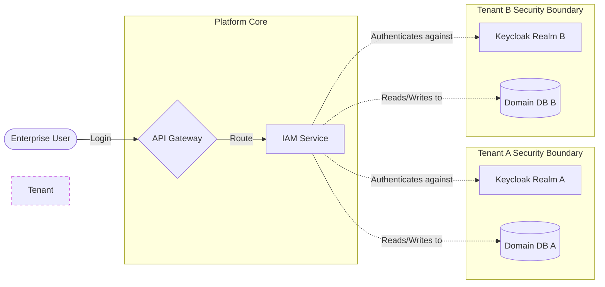

# 🚀 SecuFusion: The Scalable Security Platform Pitch

*A guide for pitching the SecuFusion Multi-Tenant Microservice Architecture to technical stakeholders, management, or investors.*

---

##  elevator_pitch = "What is SecuFusion?"

**SecuFusion is an event-driven, multi-tenant security platform built for massive scale.**
It is designed to solve the chaos of enterprise security management by decoupling rigid legacy systems into independently scalable microservices. By combining **Keycloak** for centralized zero-trust identity, **Apache Kafka** for high-throughput asynchronous event processing, and **Spring Boot** for resilient modular APIs, SecuFusion provides a platform where thousands of independent tenant organizations can monitor, trigger, and resolve security events in real-time without latency or data bleed.

---

## 🚨 The Problem

Modern Enterprise Security and Managed Security Service Providers (MSSPs) face three massive hurdles:
1. **The Multi-Tenant Nightmare**: Managing hundreds of clients requires strict data isolation. Legacy systems mix client data, causing severe compliance and data-bleed risks.
2. **The Synchronous Bottleneck**: Traditional monolithic architectures process security events synchronously. If an external API is slow, the entire application freezes. This destroys user experience and halts critical threat responses.
3. **The Authorization Maze**: Validating user permissions across complex organizational hierarchies requires constant database querying, killing horizontal scalability.

---

## ⚡ The SecuFusion Solution

SecuFusion was built from the ground up to solve these problems through a world-class architectural design:

### 1. Absolute Tenant Isolation (Data & Auth)
Every tenant in SecuFusion exists in a secured silo. 
* **Auth**: SecuFusion integrates with Keycloak to provide independent **OIDC Realms** for every tenant, allowing custom SSO (like Azure AD) without affecting others.
* **Data**: Our PostgreSQL databases utilize strict domain-separated tables managed by Flyway. Master MSSP administrators can see everything, but a standard Enterprise Admin cannot even conceptualize data outside their tenant ID.




### 2. Event-Driven Architecture (Apache Kafka)
We stopped waiting for APIs to finish. 
* **Instant UX**: When a user performs an action (like logging in or configuring a policy), the frontend gets a response in milliseconds. 
* **The Engine**: In the background, SecuFusion fires an asynchronous message (e.g., `DeviceRegistrationEvent`) into an **Apache Kafka message bus**. 
* **The Scale**: Distributed Kafka consumers, separated into 6 robust partitions, process thousands of security events concurrently without ever slowing down the user portal.

```mermaid
sequenceDiagram
    participant UI as User Portal
    participant API as Microservice
    participant Ext as 3rd Party / Heavy DB Task

    box rgba(239, 68, 68, 0.1) The Old Way (Synchronous Bottleneck)
        UI->>API: 1. Trigger Action
        API->>Ext: 2. Process Heavy Task (Wait...)
        Ext--xAPI: 3. Timeout or Slow Response
        API-->>UI: 4. Error or Slow UX (User Frustrated)
    end

    box rgba(16, 185, 129, 0.1) SecuFusion Way (Kafka Event-Driven)
        UI->>API: 1. Trigger Action
        Note over API: Instantly publish event to Kafka
        API-->>UI: 2. Success 200 OK (Instant UX!)
        API-)Ext: 3. Background Kafka Consumer safely retries/processes
    end
```

### 3. Stateless Security (Decentralized JWT)
SecuFusion achieves massive horizontal scale because our microservices do not need to constantly ask the database "Who is this user?".
* **Zero-Trust**: Keycloak issues a cryptographically signed JSON Web Token (JWT).
* **Decentralized Validation**: Every Spring Boot microservice independently intercepts network traffic and mathematically validates the JWT signature in memory using cached Public Keys.
* **Granular RBAC**: The JWT payload contains explicit `realm_access.roles`. We enforce strict Role-Based Access Control (RBAC) across 38 distinct scopes without a single database hit.

---

## 📈 Business Value & ROI

Why should a business adopt or invest in the SecuFusion Architecture?

* **Cost-Efficient Scalability**: Because the platform is built on microservices (`sfn-iam-api`, `sfn-events-api`, `sfn-tenants-api`), you only scale the parts of the system under load. If the Events API is handling 10,000 requests a second, we auto-scale that single service while the IAM service remains cost-effectively small.
* **Enterprise Compliance Out-of-the-Box**: Strict database separation and Keycloak Federation makes achieving SOC2, HIPAA, and GDPR compliance exponentially easier.
* **Future-Proof Extensibility**: Because services communicate blindly over Kafka topics, adding a new service (like an AI Anomaly Detection Engine) requires zero changes to the existing codebase. The new AI service simply subscribes to the Kafka topic.

---

## 🎤 The Pitch Sequence (How to Present This)

If you are presenting this live with the Architecture Diagrams, follow this narrative flow:

1. **Start with the User Experience**: Point to the **Frontend** and explain how the user logs in. Emphasize that the API Gateway abstracts all complexity from the user.
2. **Highlight Security**: Walk through the **Auth Flow**. Explain how Keycloak handles the heavy lifting, issuing the secure JWT. Make sure to note that the JWT contains all the RBAC roles.
3. **The "Aha!" Moment (Kafka)**: This is crucial. Point out that immediately after login, the IAM service triggers an asynchronous Kafka event (`DeviceRegistrationEvent`). Emphasize that the user does not wait for this. It happens completely decoupled in the background.
4. **The Resolution**: Show how the `sfn-events-api` consumes that Kafka event and commits it safely to the PostgreSQL database.
5. **Close with Scalability**: Conclude by stating that this exact pattern (HTTP entry 👉 Kafka Event 👉 Async Processing) is how SecuFusion handles millions of events seamlessly.
