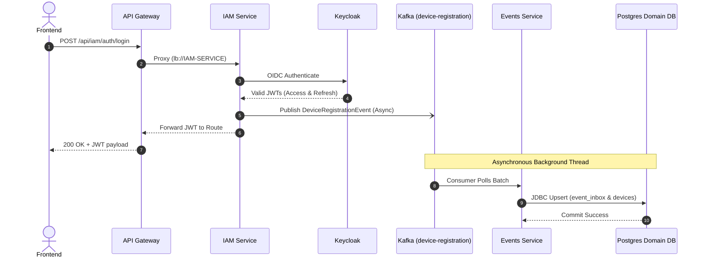
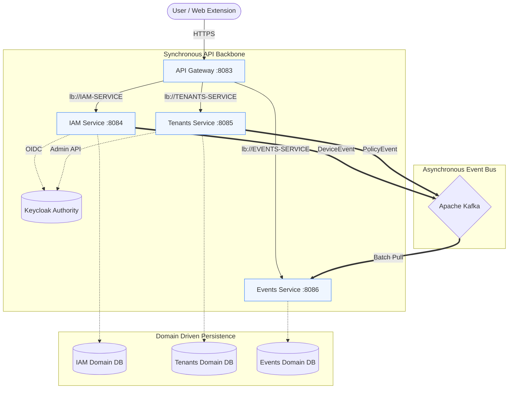

# 🗺️ SecuFusion — Service Communication Map

This document outlines the **Auth to Async Event Flow**, which represents the literal journey a request takes through the SecuFusion microservice ecosystem — starting from an initial user login and ending in a completely decoupled asynchronous database persistence.

This acts as the text companion to the visual sequence flowchart found in `secufusion-architecture.html`.

---

## The 8-Step Auth to Async Kafka Flow

This is the exact sequence of technical execution mapped 1:1 with the Spring Boot implementation (`sfn-iam-api` & `sfn-events-api`).

### 1. 🖥️ Frontend / Extension
* **Action**: User triggers the login form or the extension initiates an auth request.
* **Network Call**: `POST /api/iam/auth/login` (Includes username and password payload).

### 2. 🚪 API Gateway (`sfn-gateway-api`)
* **Action**: The Spring Cloud Gateway intercepts the external HTTP request on port 8083.
* **Routing**: Using Eureka service discovery, it dynamically routes the payload to `lb://IAM-SERVICE`.

### 3. & 4. 🔐 IAM to Keycloak Negotiation
* **Action**: The IAM Service (`sfn-iam-api`) acts as the broker. It takes the credentials and fires an **OIDC Authenticate Request** directly to the connected Keycloak Auth Server.
* **Validation**: Keycloak evaluates the credentials against the specific tenant Realm's PostgreSQL database.
* **Return**: Upon success, Keycloak issues a cryptographically signed Access Token (JWT) and a Refresh Token, returning them to the IAM Service.

### 5. 👤 IAM Asynchronous Trigger
* **Action**: The IAM Service completes the HTTP circuit by returning the JWT to the frontend. However, it *immediately* triggers an asynchronous tracking event in the background via `LoginAuditService.java`.
* **Payload**: Constructs a `DeviceRegistrationEvent` containing the Tenant ID, user details, and device metadata.

### 6. 📦 Kafka Message Bus
* **Action**: The `DeviceRegistrationProducer.java` uses `KafkaTemplate` to publish the event to the `device-registration` Kafka topic.
* **Configuration**: Distributed across 6 partitions, keyed automatically by `tenantId` to ensure ordered, concurrent processing.

### 7. 📊 Events Service Consumption
* **Action**: Over in `sfn-events-api`, the `DeviceRegistrationConsumer.java` `@KafkaListener` actively listens to the topic.
* **Process**: It polls the topic, pulling a batch of payloads. It acknowledges the batch manually (`AckMode.MANUAL`) only once they are successfully parsed.

### 8. 🐘 PostgreSQL Database Persistence
* **Action**: The Events Service takes the consumed tracking payload and executes a JDBC Upsert.
* **Commit**: The tracking data is permanently written into the `event_inbox` and `devices` tables on the isolated PostgreSQL Domain DB. 

*(Total Time: < 300ms. Frontend User sees instant login, while background tracking resolves decoupled via Kafka).*

---

## 📊 Flow Diagrams

### The 8-Step Auth to Async Sequence
The precise step-by-step transaction mapping for the process described above.

### High-Level Service Communication Topology
This visualizes the boundaries between Synchronous API routing and Asynchronous Event processing.

