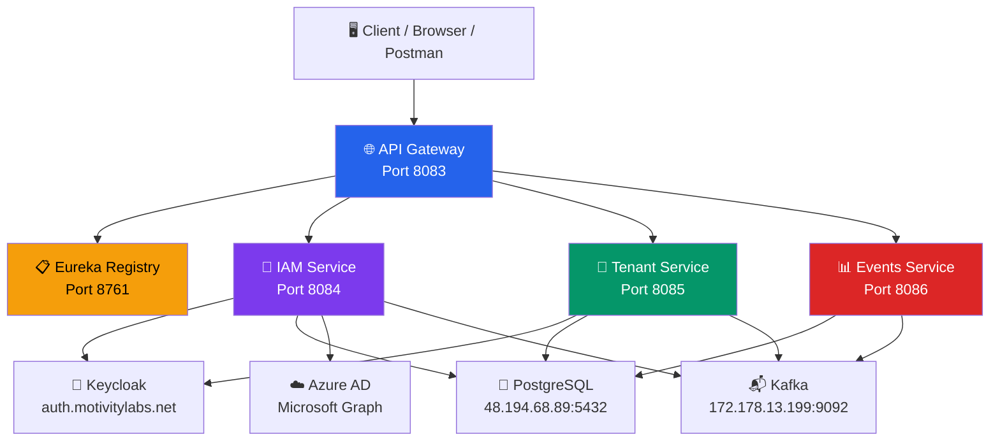
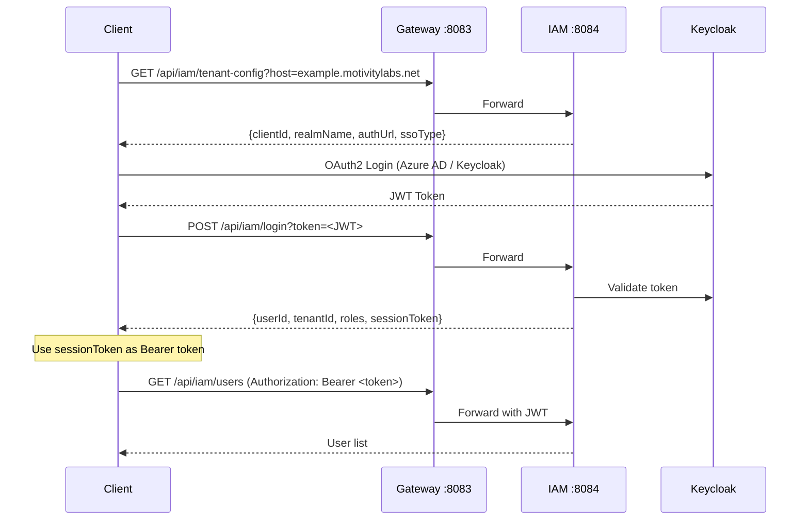

# Secufusion Microservices — Complete API Audit Report

> **Date:** April 9, 2026  
> **Auditor:** Automated Code Analysis  
> **Scope:** sfn-iam-api, sfn-tenants-api, sfn-events-api, sfn-gateway-api, sfn-eureka-api  
> **Deliverables:** API catalog, Postman collection, service health validation

---

## Executive Summary

A comprehensive audit was conducted across the entire Secufusion microservice codebase. **300+ REST API endpoints** were discovered, documented, and organized into an import-ready Postman collection. All 5 backend services were verified as **running and registered** in Eureka.

| Metric | Value |
|---|---|
| Microservices audited | **5** |
| Controller classes analyzed | **49** |
| Total API endpoints discovered | **~300+** |
| Postman requests generated | **100+** (grouped into 20 folders) |
| Public (no-auth) endpoints | **~8** |
| JWT-protected endpoints | **~290+** |
| API Key endpoints | **~5** |

---

## 1. Architecture Topology



### Gateway Routing Table

| Route ID | Predicate | Target |
|---|---|---|
| `IAM-SERVICE` | `/api/iam/**` | `lb://IAM-SERVICE` |
| `TENANT-SERVICE` | `/api/tenants/**` | `lb://TENANT-SERVICE` |
| `EVENTS-SERVICE` | `/api/events/**` | `lb://EVENTS-SERVICE` |

### Key Infrastructure

| Component | Endpoint | Purpose |
|---|---|---|
| **PostgreSQL** | `48.194.68.89:5432/develop` | Single shared DB |
| **Keycloak** | `auth.motivitylabs.net` | OIDC / SSO Provider |
| **Kafka** | `172.178.13.199:9092` | Async messaging |
| **Azure AD** | Microsoft Graph API | Enterprise SSO + group sync |

---

## 2. Service Health Validation

All services were validated as running and registered with Eureka:


| Service | Port | PID | Eureka Status |
|---|---|---|---|
| ✅ API Gateway | 8083 | 14964 | **UP** |
| ✅ IAM Service | 8084 | — | **UP** |
| ✅ Tenant Service | 8085 | — | **UP** |
| ✅ Events Service | 8086 | — | **UP** |
| ✅ Eureka | 8761 | — | Self (registry) |

> [!NOTE]
> The Swagger UI aggregation at `/swagger-ui.html` fails with "Internal Server Error" for OpenAPI doc routes. This is because the gateway config uses `lb://` URIs for the OpenAPI `SetPath` filters, which don't resolve to direct HTTP. The actual API routes work correctly through the gateway.

---

## 3. Authentication Architecture

### Auth Providers Supported

| Provider | Type | Usage |
|---|---|---|
| **Keycloak** | OIDC JWT | Primary auth for dashboard users |
| **Azure AD** | OAuth2 / SAML | Enterprise SSO tenants |
| **API Key** | Static key | Browser extension event ingestion |

### Auth Flow



### Tenant Resolution

Most endpoints extract `tenantId` from the JWT token via `JwtUtil.getTenantFromRequest(request)`. No explicit tenant ID is needed in the URL for these endpoints.

---

## 4. Complete Endpoint Catalog

### 4.1 IAM Service (`/api/iam`) — 20 Controllers, ~130 Endpoints

#### Auth Controller (`/api/iam`)

| # | Method | Path | Auth | Description |
|---|---|---|---|---|
| 1 | `GET` | `/tenant-config/v1?host=` | 🔓 Public | Get tenant config (with Referer validation) |
| 2 | `GET` | `/tenant-config?host=` | 🔓 Public | Get tenant config (no validation) |
| 3 | `POST` | `/login?token=` | 🔓 Public | Login with Azure/Keycloak JWT |
| 4 | `POST` | `/login/extension?token=&deviceUserEmail=` | 🔓 Public | Extension login |
| 5 | `POST` | `/login/sso?token=` | 🔓 Public | SSO login |

#### User Controller (`/api/iam/users`)

| # | Method | Path | Auth | Description |
|---|---|---|---|---|
| 1 | `POST` | `/{tenantId}` | 🔒 JWT | Create user under tenant |
| 2 | `POST` | `/` | 🔒 JWT | Create user (tenant from JWT) |
| 3 | `GET` | `/{userId}` | 🔒 JWT | Get user by ID |
| 4 | `GET` | `/userId?userId=` | 🔒 JWT | Get user (tenant from JWT) |
| 5 | `GET` | `/` | 🔒 JWT | Get all users |
| 6 | `GET` | `/tenant/{tenantId}` | 🔒 JWT | Get users by tenant |
| 7 | `PUT` | `/{userId}` | 🔒 JWT | Update user |
| 8 | `PUT` | `/update?userId=` | 🔒 JWT | Update (tenant from JWT) |
| 9 | `DELETE` | `/{userId}` | 🔒 JWT | Delete user |
| 10 | `GET` | `/check?userName=&phoneNumber=&email=` | 🔒 JWT | Validate uniqueness |
| 11 | `POST` | `/tenants/{tenantId}/users/{userId}/resend-verification` | 🔒 JWT | Resend verification |

#### Roles Controller (`/api/iam/roles`)

| # | Method | Path | Auth | Description |
|---|---|---|---|---|
| 1 | `POST` | `/` | 🔒 JWT | Create role |
| 2 | `PUT` | `/{id}` | 🔒 JWT | Update role |
| 3 | `GET` | `/` | 🔒 JWT | Get all roles |
| 4 | `GET` | `/{id}` | 🔒 JWT | Get role by ID |
| 5 | `POST` | `/activate?roleId=` | 🔒 JWT | Activate role |

#### Scopes Controller (`/api/iam/scopes`)

| # | Method | Path | Auth | Description |
|---|---|---|---|---|
| 1 | `GET` | `/` | 🔒 JWT | Get all scopes |
| 2 | `GET` | `/{scopeId}` | 🔒 JWT | Get by ID |
| 3 | `GET` | `/menu/{menuName}` | 🔒 JWT | Get by menu |
| 4 | `GET` | `/menu/{menuName}/submenu/{subMenu}` | 🔒 JWT | Get by menu+submenu |
| 5 | `POST` | `/` | 🔒 JWT | Create scope |
| 6 | `PUT` | `/{scopeId}` | 🔒 JWT | Update scope |
| 7 | `PUT` | `/{scopeId}/tenant-types` | 🔒 JWT | Update tenant types |
| 8 | `DELETE` | `/{scopeId}` | 🔒 JWT | Delete scope |

#### Groups Controller (`/api/iam/groups`)

| # | Method | Path | Auth | Description |
|---|---|---|---|---|
| 1 | `POST` | `/` | 🔒 JWT | Create group |
| 2 | `PUT` | `/{id}` | 🔒 JWT | Update group |
| 3 | `GET` | `/id?id=` | 🔒 JWT | Get by ID |
| 4 | `GET` | `/` | 🔒 JWT | Get all |
| 5 | `GET` | `/tenant?tenantId=` | 🔒 JWT | Get by tenant |

#### Feature Controller (`/api/iam/features`)

| # | Method | Path | Auth | Description |
|---|---|---|---|---|
| 1 | `POST` | `/` | 🔒 JWT | Create feature |
| 2 | `GET` | `/` | 🔒 JWT | Get all |
| 3 | `GET` | `/{id}` | 🔒 JWT | Get by ID |
| 4 | `PUT` | `/{id}` | 🔒 JWT | Update |
| 5 | `DELETE` | `/{id}` | 🔒 JWT | Delete |
| 6 | `PUT` | `/{id}/deactivate` | 🔒 JWT | Deactivate |
| 7 | `PUT` | `/{id}/activate` | 🔒 JWT | Activate |

#### Feature Group Controller (`/api/iam/feature-groups`)

| # | Method | Path | Auth | Description |
|---|---|---|---|---|
| 1 | `POST` | `/` | 🔒 JWT | Create |
| 2 | `PUT` | `/{id}` | 🔒 JWT | Update |
| 3 | `GET` | `/{id}` | 🔒 JWT | Get by ID |
| 4 | `GET` | `/code/{code}` | 🔒 JWT | Get by code |
| 5 | `GET` | `/` | 🔒 JWT | Get all |
| 6 | `GET` | `/active` | 🔒 JWT | Get active |
| 7 | `DELETE` | `/{id}` | 🔒 JWT | Delete |
| 8 | `PATCH` | `/{id}/activate` | 🔒 JWT | Activate |
| 9 | `PATCH` | `/{id}/deactivate` | 🔒 JWT | Deactivate |

#### Package Controller (`/api/iam/packages`)

| # | Method | Path | Auth | Description |
|---|---|---|---|---|
| 1 | `POST` | `/` | 🔒 JWT | Create |
| 2 | `PUT` | `/{id}` | 🔒 JWT | Update |
| 3 | `GET` | `/{id}` | 🔒 JWT | Get by ID |
| 4 | `GET` | `/` | 🔒 JWT | Get all |
| 5 | `DELETE` | `/{id}` | 🔒 JWT | Delete |

#### Package Feature Mapping Controller (`/api/iam/package-feature-mappings`)

| # | Method | Path | Auth | Description |
|---|---|---|---|---|
| 1 | `POST` | `/` | 🔒 JWT | Create mapping |
| 2 | `POST` | `/bulk` | 🔒 JWT | Bulk create |
| 3 | `PUT` | `/{id}` | 🔒 JWT | Update |
| 4 | `DELETE` | `/{id}` | 🔒 JWT | Delete |
| 5 | `DELETE` | `/package/{packageId}` | 🔒 JWT | Delete all for package |
| 6 | `GET` | `/{id}` | 🔒 JWT | Get by ID |
| 7 | `GET` | `/package/{packageId}` | 🔒 JWT | Get by package |
| 8 | `GET` | `/matrix/{packageId}` | 🔒 JWT | Feature matrix |
| 9 | `GET` | `/matrices` | 🔒 JWT | All matrices |
| 10 | `GET` | `/check-access?packageId=&featureCode=` | 🔒 JWT | Check access |
| 11 | `GET` | `/access-level?packageId=&featureCode=` | 🔒 JWT | Get access level |
| 12 | `GET` | `/retention?packageId=&featureCode=` | 🔒 JWT | Get retention |

#### Tenant Subscription Controller (`/api/iam/subscriptions`)

| # | Method | Path | Auth | Description |
|---|---|---|---|---|
| 1 | `POST` | `/` | 🔒 JWT | Create subscription |
| 2 | `POST` | `/default/{tenantId}` | 🔒 JWT | Create default |
| 3 | `GET` | `/tenant/{tenantId}` | 🔒 JWT | Active subscription |
| 4 | `GET` | `/tenant/{tenantId}/history` | 🔒 JWT | History |
| 5 | `POST` | `/tenant/{tenantId}/upgrade?packageId=` | 🔒 JWT | Upgrade |
| 6 | `POST` | `/tenant/{tenantId}/downgrade?packageId=` | 🔒 JWT | Downgrade |
| 7 | `POST` | `/tenant/{tenantId}/convert-trial` | 🔒 JWT | Convert trial |
| 8 | `POST` | `/tenant/{tenantId}/cancel` | 🔒 JWT | Cancel |
| 9 | `POST` | `/tenant/{tenantId}/renew` | 🔒 JWT | Renew |
| 10 | `GET` | `/pricing/packages` | 🔒 JWT | Package pricing |
| 11 | `GET` | `/pricing/package/{packageId}` | 🔒 JWT | Single package pricing |
| 12 | `GET` | `/pricing/addons` | 🔒 JWT | Addon pricing |
| 13 | `GET` | `/pricing/addon/{featureCode}` | 🔒 JWT | Addon by code |
| 14 | `GET` | `/pricing/addon/{featureCode}/cycle/{billingCycleCode}` | 🔒 JWT | By billing cycle |

#### Tenant Feature Controller (`/api/iam/tenant-features`)

| # | Method | Path | Auth | Description |
|---|---|---|---|---|
| 1 | `GET` | `/{tenantId}` | 🔒 JWT | All features |
| 2 | `GET` | `/{tenantId}/check/{featureCode}` | 🔒 JWT | Check access |
| 3 | `GET` | `/{tenantId}/access-level/{featureCode}` | 🔒 JWT | Access level |
| 4 | `GET` | `/{tenantId}/retention/{featureCode}` | 🔒 JWT | Retention days |
| 5 | `PUT` | `/{tenantId}/package` | 🔒 JWT | Update package |

#### Tenant Addon Feature Controller (`/api/iam/tenant-addon-features`)

| # | Method | Path | Auth | Description |
|---|---|---|---|---|
| 1 | `POST` | `/` | 🔒 JWT | Create addon |
| 2 | `POST` | `/bulk` | 🔒 JWT | Bulk create |
| 3 | `GET` | `/{addonId}` | 🔒 JWT | Get by ID |
| 4 | `GET` | `/tenant/{tenantId}` | 🔒 JWT | All for tenant |
| 5 | `GET` | `/tenant/{tenantId}/active` | 🔒 JWT | Active only |
| 6 | `GET` | `/tenant/{tenantId}/feature/{featureCode}` | 🔒 JWT | By tenant+feature |
| 7 | `GET` | `/tenant/{tenantId}/has-addon/{featureCode}` | 🔒 JWT | Check exists |
| 8 | `PUT` | `/{addonId}` | 🔒 JWT | Update |
| 9 | `PATCH` | `/{addonId}/toggle?enabled=` | 🔒 JWT | Toggle |
| 10 | `DELETE` | `/{addonId}` | 🔒 JWT | Delete |
| 11 | `DELETE` | `/tenant/{tenantId}/feature/{featureId}` | 🔒 JWT | Delete by combo |
| 12 | `POST` | `/tenant/{tenantId}/purchase` | 🔒 JWT | Purchase |
| 13 | `POST` | `/{addonId}/renew?billingCycleId=` | 🔒 JWT | Renew |
| 14 | `POST` | `/{addonId}/convert-trial?billingCycleId=` | 🔒 JWT | Convert trial |
| 15 | `GET` | `/tenant/{tenantId}/billing-summary` | 🔒 JWT | Billing summary |

#### Login Audit Controller (`/api/iam/audit/login`) — 27 Endpoints

| # | Method | Path | Auth | Description |
|---|---|---|---|---|
| 1 | `GET` | `/events?page=&size=` | 🔒 JWT | All audit events |
| 2 | `GET` | `/events/user/{userId}` | 🔒 JWT | By user |
| 3 | `GET` | `/events/type/{eventType}` | 🔒 JWT | By type |
| 4 | `GET` | `/events/source/{sourceService}` | 🔒 JWT | By source |
| 5 | `GET` | `/events/timerange?start=&end=` | 🔒 JWT | Time range |
| 6 | `GET` | `/events/session/{sessionId}` | 🔒 JWT | Session events |
| 7 | `GET` | `/events/users?start=&end=` | 🔒 JWT | User mgmt events |
| 8 | `GET` | `/events/roles?start=&end=` | 🔒 JWT | Role mgmt events |
| 9 | `GET` | `/events/groups?start=&end=` | 🔒 JWT | Group mgmt events |
| 10 | `GET` | `/stats/by-source?start=&end=` | 🔒 JWT | Stats by source |
| 11 | `DELETE` | `/events/cleanup?daysToKeep=` | 🔒 JWT | Cleanup old |
| 12 | `GET` | `/devices/user/{userId}` | 🔒 JWT | User devices |
| 13 | `GET` | `/devices/user/{userId}/active` | 🔒 JWT | Active devices |
| 14 | `GET` | `/devices/user/{userId}/trusted` | 🔒 JWT | Trusted devices |
| 15 | `GET` | `/devices` | 🔒 JWT | All tenant devices |
| 16 | `GET` | `/devices/status/{status}` | 🔒 JWT | By status |
| 17 | `GET` | `/devices/{deviceId}/events` | 🔒 JWT | Device events |
| 18 | `GET` | `/devices/fingerprint/{fp}/events` | 🔒 JWT | By fingerprint |
| 19 | `GET` | `/devices/search?q=` | 🔒 JWT | Search devices |
| 20 | `POST` | `/devices/user/{userId}/trust?fingerprint=` | 🔒 JWT | Trust device |
| 21 | `POST` | `/devices/user/{userId}/block?fingerprint=` | 🔒 JWT | Block device |
| 22 | `POST` | `/devices/user/{userId}/revoke-all` | 🔒 JWT | Revoke all |
| 23 | `GET` | `/devices/new-logins?start=&end=` | 🔒 JWT | New device logins |
| 24 | `GET` | `/devices/stats?start=&end=` | 🔒 JWT | Device stats |
| 25 | `GET` | `/devices/high-failures?threshold=` | 🔒 JWT | High failures |
| 26 | `GET` | `/devices/inactive?since=` | 🔒 JWT | Inactive devices |
| 27 | `GET` | `/devices/user/{userId}/count` | 🔒 JWT | Count devices |

#### Events Group Controller (`/api/iam/events-groups`) — 19 Endpoints

| # | Method | Path | Auth | Description |
|---|---|---|---|---|
| 1 | `GET` | `/?authorizedOnly=&includePolicies=` | 🔒 JWT | All events groups |
| 2 | `GET` | `/{groupId}` | 🔒 JWT | Get by ID |
| 3 | `POST` | `/` | 🔒 JWT | Create APIKEY group |
| 4 | `PUT` | `/{groupId}` | 🔒 JWT | Update |
| 5 | `PUT` | `/groups/{groupId}/{action}` | 🔒 JWT | Authorize/unauthorize |
| 6 | `DELETE` | `/{groupId}` | 🔒 JWT | Delete |
| 7 | `POST` | `/{groupId}/authorize-extension` | 🔒 JWT | Authorize extension |
| 8 | `DELETE` | `/{groupId}/authorize-extension` | 🔒 JWT | Revoke extension |
| 9 | `POST` | `/{groupId}/device-users` | 🔒 JWT | Assign users |
| 10 | `DELETE` | `/{groupId}/device-users/{deviceUserId}` | 🔒 JWT | Remove user |
| 11 | `GET` | `/{groupId}/device-users` | 🔒 JWT | List members |
| 12 | `GET` | `/{groupId}/policies` | 🔒 JWT | Group policies |
| 13 | `POST` | `/sync-members` | 🔒 JWT | Sync Azure members |
| 14 | `GET` | `/stats/memberships` | 🔒 JWT | Group stats |
| 15 | `GET` | `/device-users/stats/memberships` | 🔒 JWT | User stats |
| 16 | `GET` | `/device-users/{id}/policies` | 🔒 JWT | User policies |
| 17 | `GET` | `/device-users/{id}/groups` | 🔒 JWT | User groups |
| 18 | `GET` | `/{groupId}/history` | 🔒 JWT | Group history |
| 19 | `GET` | `/history` | 🔒 JWT | Tenant history |

#### SSO Configuration Controller (`/api/iam/sso-configurations`)

| # | Method | Path | Auth | Description |
|---|---|---|---|---|
| 1 | `POST` | `/` | 🔒 JWT | Create SSO config |
| 2 | `GET` | `/` | 🔒 JWT | List all |
| 3 | `GET` | `/{id}` | 🔒 JWT | Get by ID |
| 4 | `PUT` | `/{id}` | 🔒 JWT | Update |
| 5 | `DELETE` | `/{id}` | 🔒 JWT | Delete |
| 6 | `PUT` | `/{id}/activate` | 🔒 JWT | Activate |
| 7 | `GET` | `/roles` | 🔒 JWT | Azure app roles |
| 8 | `GET` | `/groups?search=` | 🔒 JWT | Search Azure groups |

#### Extension Auth Controller (`/api/iam/extension`)

| # | Method | Path | Auth | Description |
|---|---|---|---|---|
| 1 | `POST` | `/auth` | 🔒 JWT | Browser extension auth (Azure only) |

#### Dropdowns Controller (`/api/iam`)

| # | Method | Path | Auth | Description |
|---|---|---|---|---|
| 1 | `GET` | `/regions` | 🔒 JWT | All regions |
| 2 | `GET` | `/countries?regionId=` | 🔒 JWT | Countries by region |
| 3 | `GET` | `/states?countryId=` | 🔒 JWT | States by country |
| 4 | `GET` | `/cities?stateId=` | 🔒 JWT | Cities by state |
| 5 | `GET` | `/industries` | 🔒 JWT | Industries |
| 6 | `GET` | `/tenants/billing` | 🔒 JWT | Billing types |
| 7 | `GET` | `/tenants/types` | 🔒 JWT | Tenant types |
| 8 | `GET` | `/groups/dropdown` | 🔒 JWT | Groups dropdown |
| 9 | `GET` | `/roles/dropdown?action=` | 🔒 JWT | Roles dropdown |
| 10 | `GET` | `/package-types` | 🔒 JWT | Package types |
| 11 | `GET` | `/billing-cycles` | 🔒 JWT | Billing cycles |

#### Access Level Controller (`/api/iam/access-levels`)

| # | Method | Path | Auth |
|---|---|---|---|
| 1 | `GET` | `/` | 🔒 JWT |
| 2 | `GET` | `/active` | 🔒 JWT |

#### Retention Period Controller (`/api/iam/retention-periods`)

| # | Method | Path | Auth |
|---|---|---|---|
| 1 | `GET` | `/` | 🔒 JWT |
| 2 | `GET` | `/active` | 🔒 JWT |

#### API Flag Admin Controller (`/api/iam/admin/api-flags`)

| # | Method | Path | Auth | Description |
|---|---|---|---|---|
| 1 | `POST` | `/apis` | 🔒 JWT | Create flag |
| 2 | `PUT` | `/tenants?tenantId=&key=` | 🔒 JWT | Toggle API |
| 3 | `GET` | `/mappings` | 🔒 JWT | List mappings |

---

### 4.2 Tenant Service (`/api/tenants`) — 16 Controllers, ~80 Endpoints

| Controller | Base Path | Endpoints | Description |
|---|---|---|---|
| **TenantController** | `/api/tenants` | ~10 | Tenant CRUD, provisioning, welcome email |
| **AuthController** | `/api/tenants/auth` | ~3 | Tenant-level auth ops |
| **SessionController** | `/api/tenants/sessions` | 22 | Full Keycloak session management |
| **BrowserPolicyController** | `/api/tenants/policy` | ~6 | Browser policy CRUD |
| **NetworkPolicyController** | `/api/tenants/network-policy` | ~6 | Network policy CRUD |
| **ExtensionPolicyController** | `/api/tenants/extension-policy` | 6 | Extension policy CRUD + mapping |
| **PolicyMappingController** | `/api/tenants/policy/mapping` | 7 | Map policies to groups |
| **SmtpConfigController** | `/api/tenants/smtp-config` | 12 | SMTP config CRUD + sync |
| **WebhookController** | `/api/tenants/webhooks` | ~5 | Webhook config management |
| **NotificationController** | `/api/tenants/notifications` | ~5 | Notification management |
| **LandingPageController** | `/api/tenants/landing-pages` | ~4 | Landing page CRUD |
| **SubscriptionController** | `/api/tenants/subscriptions` | ~4 | Subscription management |
| **LoginAuditController** | `/api/tenants/audit/login` | ~5 | Login auditing |
| **AuditLogController** | `/api/tenants/audit-logs` | ~4 | General audit logs |
| **DashboardController** | `/api/tenants/{tenantId}/dashboard` | ~5 | Dashboard data |
| **ExtensionAuthController** | (commented out) | 0 | Disabled |

#### Session Controller Detail (`/api/tenants/sessions`) — 22 Endpoints

| # | Method | Path | Auth | Description |
|---|---|---|---|---|
| 1 | `GET` | `/` | 🔒 JWT | All sessions |
| 2 | `GET` | `/count` | 🔒 JWT | Session count |
| 3 | `GET` | `/summary` | 🔒 JWT | Summary |
| 4 | `GET` | `/stats` | 🔒 JWT | Statistics |
| 5 | `GET` | `/{sessionId}` | 🔒 JWT | Get session |
| 6 | `GET` | `/users` | 🔒 JWT | Session users |
| 7 | `GET` | `/me` | 🔒 JWT | My sessions |
| 8 | `GET` | `/me/count` | 🔒 JWT | My count |
| 9 | `DELETE` | `/me/current` | 🔒 JWT | Logout current |
| 10 | `DELETE` | `/me/others` | 🔒 JWT | Logout others |
| 11 | `DELETE` | `/me` | 🔒 JWT | Logout all mine |
| 12 | `GET` | `/user/{userId}` | 🔒 JWT | User sessions |
| 13 | `GET` | `/user/{userId}/count` | 🔒 JWT | User count |
| 14 | `DELETE` | `/user/{userId}` | 🔒 JWT | Kill user sessions |
| 15 | `GET` | `/client/{clientId}` | 🔒 JWT | Client sessions |
| 16 | `GET` | `/offline/user/{userId}` | 🔒 JWT | Offline sessions |
| 17 | `DELETE` | `/offline/user/{userId}` | 🔒 JWT | Delete offline |
| 18 | `POST` | `/search` | 🔒 JWT | Search sessions |
| 19 | `DELETE` | `/{sessionId}` | 🔒 JWT | Delete session |
| 20 | `DELETE` | `/bulk` | 🔒 JWT | Bulk delete |
| 21 | `DELETE` | `/all` | 🔒 JWT | Logout all realm |

#### SMTP Config Detail (`/api/tenants/smtp-config`) — 12 Endpoints

| # | Method | Path | Auth | Description |
|---|---|---|---|---|
| 1 | `POST` | `/` | 🔒 JWT | Create config |
| 2 | `GET` | `/` | 🔒 JWT | Get config |
| 3 | `GET` | `/own` | 🔒 JWT | Get own |
| 4 | `PUT` | `/` | 🔒 JWT | Update |
| 5 | `DELETE` | `/` | 🔒 JWT | Delete |
| 6 | `POST` | `/test` | 🔒 JWT | Test connection |
| 7 | `POST` | `/test-email` | 🔒 JWT | Send test email |
| 8 | `GET` | `/default` | 🔒 JWT | Default config |
| 9 | `POST` | `/default` | 🔒 JWT | Create default |
| 10 | `PUT` | `/default` | 🔒 JWT | Update default |
| 11 | `POST` | `/sync-keycloak` | 🔒 JWT | Sync to Keycloak |
| 12 | `POST` | `/default/sync-all` | 🔒 JWT | Sync all realms |

---

### 4.3 Events Service (`/api/events`) — 13 Controllers, ~90 Endpoints

| Controller | Base Path | Endpoints | Description |
|---|---|---|---|
| **EventController** | `/api/events` | 14 | Core browser event CRUD + search/filter |
| **DeviceController** | `/api/events/devices` | ~8 | Device management |
| **DeviceUserController** | `/api/events/device-users` | ~8 | Device user management |
| **SecurityEventController** | `/api/events/security` | 12 | Security events + dashboard |
| **IncidentController** | `/api/events/incidents` | ~10 | Incident lifecycle |
| **EscalationController** | `/api/events/escalation-rules` | 4 | Escalation rule CRUD |
| **ExtensionController** | `/api/events/extensions` | ~6 | Installed extension management |
| **ExtensionApiKeyMgmt** | `/api/events/extension-api-keys` | 13 | API key lifecycle + settings |
| **ExtensionDashboard** | `/api/events/extensions/dashboard` | ~5 | Extension analytics |
| **BrowserAnalytics** | `/api/events/analytics/browser` | ~8 | Browser usage analytics |
| **UserActivityController** | `/api/events/user-activity` | 7 | User activity tracking |
| **PublicExtensionController** | `/api/public/extension` | ~3 | 🔓 Public extension ingestion |
| **ExtApiKeyPublicController** | `/api/events/public/extension` | ~2 | 🔑 Public key validation |

#### Event Controller Detail (`/api/events`) — 14 Endpoints

| # | Method | Path | Auth | Description |
|---|---|---|---|---|
| 1 | `POST` | `/` | 🔒 JWT | Create event |
| 2 | `POST` | `/kafka` | 🔒 JWT | Send via Kafka |
| 3 | `POST` | `/kafka/sync` | 🔒 JWT | Send via Kafka (sync) |
| 4 | `GET` | `/` | 🔒 JWT | Get events (paginated) |
| 5 | `GET` | `/summary` | 🔒 JWT | Event summary |
| 6 | `GET` | `/device/{deviceId}` | 🔒 JWT | By device |
| 7 | `GET` | `/device/{deviceId}/range` | 🔒 JWT | Device + time range |
| 8 | `GET` | `/user/{userName}` | 🔒 JWT | By user |
| 9 | `GET` | `/all` | 🔒 JWT | Get all |
| 10 | `GET` | `/search` | 🔒 JWT | Search |
| 11 | `GET` | `/filter` | 🔒 JWT | Filter |
| 12 | `GET` | `/count` | 🔒 JWT | Count |
| 13 | `GET` | `/categories` | 🔒 JWT | Categories |
| 14 | `GET` | `/users` | 🔒 JWT | Users with events |

#### Security Event Controller Detail (`/api/events/security`) — 12 Endpoints

| # | Method | Path | Auth | Description |
|---|---|---|---|---|
| 1 | `GET` | `/` | 🔒 JWT | All security events |
| 2 | `GET` | `/filter` | 🔒 JWT | Filter events |
| 3 | `GET` | `/severity/{severity}` | 🔒 JWT | By severity |
| 4 | `GET` | `/threat-type/{threatType}` | 🔒 JWT | By threat type |
| 5 | `GET` | `/risk-level/{riskLevel}` | 🔒 JWT | By risk level |
| 6 | `GET` | `/user/{userName}` | 🔒 JWT | By user |
| 7 | `GET` | `/device/{deviceId}` | 🔒 JWT | By device |
| 8 | `GET` | `/range` | 🔒 JWT | By date range |
| 9 | `GET` | `/critical` | 🔒 JWT | Critical only |
| 10 | `GET` | `/stats` | 🔒 JWT | Statistics |
| 11 | `GET` | `/count` | 🔒 JWT | Count |
| 12 | `GET` | `/dashboard` | 🔒 JWT | Dashboard data |

#### Extension API Key Controller Detail (`/api/events/extension-api-keys`) — 13 Endpoints

| # | Method | Path | Auth | Description |
|---|---|---|---|---|
| 1 | `POST` | `/` | 🔒 JWT | Create key |
| 2 | `GET` | `/` | 🔒 JWT | List keys |
| 3 | `GET` | `/id?keyId=` | 🔒 JWT | Get by ID |
| 4 | `PATCH` | `/{keyId}` | 🔒 JWT | Update key |
| 5 | `POST` | `/{keyId}/revoke` | 🔒 JWT | Revoke |
| 6 | `POST` | `/{keyId}/reactivate` | 🔒 JWT | Reactivate |
| 7 | `DELETE` | `/{keyId}` | 🔒 JWT | Delete |
| 8 | `POST` | `/{keyId}/rotate` | 🔒 JWT | Rotate |
| 9 | `POST` | `/{keyId}/extend-expiry` | 🔒 JWT | Extend expiry |
| 10 | `GET` | `/{keyId}/rotation-history` | 🔒 JWT | History |
| 11 | `GET` | `/stats` | 🔒 JWT | Statistics |
| 12 | `GET` | `/settings` | 🔒 JWT | Settings |
| 13 | `PATCH` | `/settings` | 🔒 JWT | Update settings |

#### User Activity Controller (`/api/events/user-activity`) — 7 Endpoints

| # | Method | Path | Auth | Description |
|---|---|---|---|---|
| 1 | `GET` | `/` | 🔒 JWT | All activity |
| 2 | `GET` | `/search` | 🔒 JWT | Search |
| 3 | `GET` | `/{userId}` | 🔒 JWT | By user |
| 4 | `GET` | `/{userId}/devices` | 🔒 JWT | User devices |
| 5 | `GET` | `/{userId}/extensions` | 🔒 JWT | User extensions |
| 6 | `GET` | `/{userId}/extension-events` | 🔒 JWT | Extension events |
| 7 | `GET` | `/stats` | 🔒 JWT | Activity stats |

---

## 5. Kafka Event Flows

| Topic | Producer | Consumer | Purpose |
|---|---|---|---|
| `device-registration` | IAM Service | Events Service | New device user provisioning |
| `quickstart-events` | Events Service | Events Service | Internal event processing |
| `policy-events` | Tenant Service | — | Policy change propagation |

---

## 6. API Call Order (Critical Workflows)

### Workflow 1: Initial Setup
```
1. GET  /api/iam/tenant-config?host=<domain>         → Discover tenant
2. POST /api/iam/login?token=<azure_jwt>              → Authenticate
3. GET  /api/iam/users                                → List users
4. POST /api/iam/users/{tenantId}                     → Create user
5. POST /api/iam/roles                                → Create role
6. PUT  /api/iam/users/{userId}                       → Assign role
```

### Workflow 2: Policy Management
```
1. POST /api/tenants/extension-policy                 → Create policy
2. POST /api/tenants/policy/mapping/groups             → Map to groups
3. POST /api/iam/events-groups                        → Create group
4. PUT  /api/iam/events-groups/groups/{id}/authorize   → Authorize group
5. POST /api/iam/events-groups/{id}/device-users       → Assign users
```

### Workflow 3: Security Monitoring
```
1. GET  /api/events/security/dashboard                → Dashboard
2. GET  /api/events/security/critical                 → Critical alerts
3. GET  /api/events/incidents                         → Active incidents
4. POST /api/events/escalation-rules                  → Create rules
```

### Workflow 4: Subscription & Billing
```
1. GET  /api/iam/packages                             → List packages
2. GET  /api/iam/subscriptions/pricing/packages        → View pricing
3. POST /api/iam/subscriptions                        → Subscribe
4. POST /api/iam/tenant-addon-features/tenant/{id}/purchase → Buy addon
5. GET  /api/iam/tenant-addon-features/tenant/{id}/billing-summary → Bill
```

---

## 7. Postman Collection

A complete, import-ready Postman collection has been generated:

📦 **File:** [Secufusion_Postman_Collection.json](file:///c:/Users/Yash/OneDrive%20-%20Motivity%20Labs/Desktop/Secufusionn/Secufusion_Postman_Collection.json)

### Collection Structure

| Folder | Requests | Domain |
|---|---|---|
| 0. Auth Flow | 4 | Login + token generation |
| 1. IAM — Users | 7 | User CRUD |
| 2. IAM — Roles | 4 | Role management |
| 3. IAM — Scopes | 2 | Scope management |
| 4. IAM — Groups | 3 | Group management |
| 5. IAM — Features & Packages | 6 | Entitlements |
| 6. IAM — Subscriptions | 4 | Subscription management |
| 7. IAM — Tenant Features | 2 | Feature access |
| 8. IAM — Login Audit | 4 | Security audit |
| 9. IAM — Events Groups | 8 | Group + policy mgmt |
| 10. IAM — SSO Config | 3 | SSO management |
| 11. IAM — Dropdowns | 7 | Reference data |
| 12. Tenants — Sessions | 6 | Session management |
| 13. Tenants — SMTP Config | 2 | Email config |
| 14. Tenants — Policies | 3 | Policy CRUD |
| 15. Events — Core Events | 6 | Event querying |
| 16. Events — Security Events | 5 | Security dashboard |
| 17. Events — Device Users & API Keys | 5 | Extension keys |
| 18. Events — Escalation Rules | 2 | Alerting |
| 19. Events — User Activity | 3 | Activity tracking |
| 20. IAM — Admin API Flags | 3 | Feature flags |

### Environment Variables

| Variable | Default | Purpose |
|---|---|---|
| `base_url` | `http://localhost:8083` | Gateway URL |
| `auth_token` | (auto-set on login) | JWT Bearer token |
| `tenant_host` | `example.motivitylabs.net` | Tenant domain |
| `tenant_id` | (auto-set) | Tenant UUID |
| `user_id` | (auto-set) | Current user UUID |
| `role_id` | — | Role reference |
| `group_id` | — | Group reference |
| `package_id` | — | Package reference |
| `events_group_id` | — | Events group ref |
| `device_user_id` | — | Device user ref |
| `extension_key_id` | — | API key ref |

---

## 8. Known Issues & Observations

> [!WARNING]
> **Swagger UI Aggregation:** The OpenAPI doc routes in gateway config use `${IAM_SERVICE_URI}` etc. which resolve to `lb://` URIs. The `SetPath` filter on these routes doesn't work with load-balanced URIs, causing "Internal Server Error" on `/openapi/*` paths. Fix: use direct HTTP URIs for OpenAPI routes.

> [!NOTE]
> **Shared Database:** All services point to the same PostgreSQL instance (`48.194.68.89:5432/develop`). Entity tables overlap across services (e.g., `Tenant`, `Users`, `roles` are referenced by IAM, Tenants, and Events). This is a read-sharing pattern, not separate databases per service.

> [!IMPORTANT]
> **No Public Health Check:** None of the services expose a public `/health` or `/actuator/health` endpoint through the gateway. Consider adding unprotected health checks for monitoring.

---

## 9. Security Observations

| Finding | Severity | Details |
|---|---|---|
| JWT required on all business endpoints | ✅ Good | Only 8 public endpoints |
| Azure AD validation on extension auth | ✅ Good | Group-based access control |
| Device fingerprint tracking | ✅ Good | Multi-device session management |
| API key rotation support | ✅ Good | Full lifecycle management |
| No rate limiting visible | ⚠️ Medium | No Spring Cloud Gateway rate limiter configured |
| Sensitive data in properties file | ⚠️ Medium | DB passwords, SMTP creds in `secufusion 6.properties` |
| CORS not configured in gateway | ⚠️ Low | May need CORS headers for browser clients |

---

*Report generated from source code analysis of the Secufusion monorepo.*
